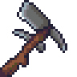

    

<h2 align="center">Mattock, a Chia plotting tool</h2>

A mattock /ˈmætək/ is a hand tool used for digging, prying, and chopping. Similar to the pickaxe, it has a long handle and a stout head which combines either a vertical axe blade with a horizontal adze (cutter mattock), or a pick and an adze (pick mattock). A cutter mattock is similar to a Pulaski. The adze of a mattock is useful for digging or hoeing, especially in hard soil.

### Introduction
This is a plotting tool, somewhat inspired by [Swar's](https://github.com/swar/Swar-Chia-Plot-Manager) but with a narrower design goal

### Instructions
- Install [node.js](https://nodejs.org/)
- Run `npx mattock`
- Follow the instructions, it'll point you to the config file
- Woah that's it?? Ye
